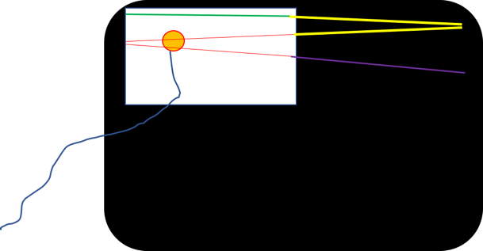
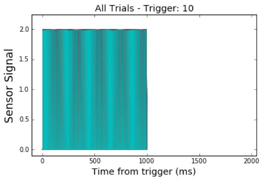
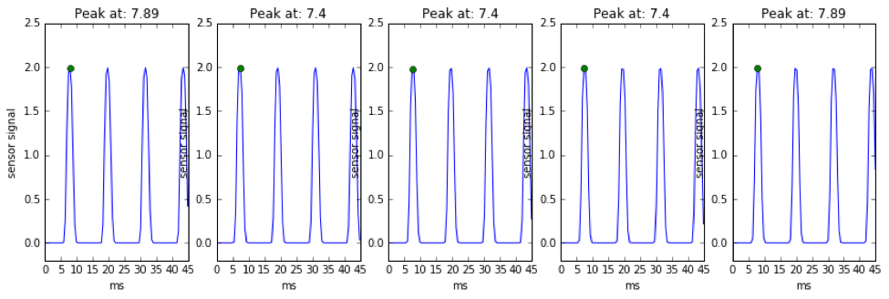
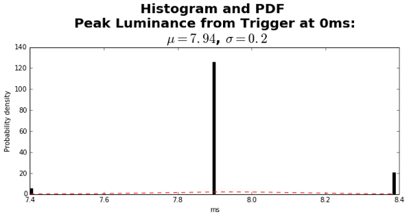
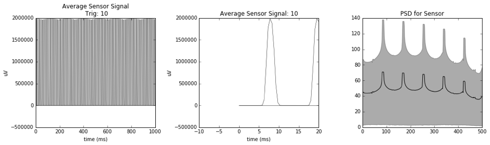
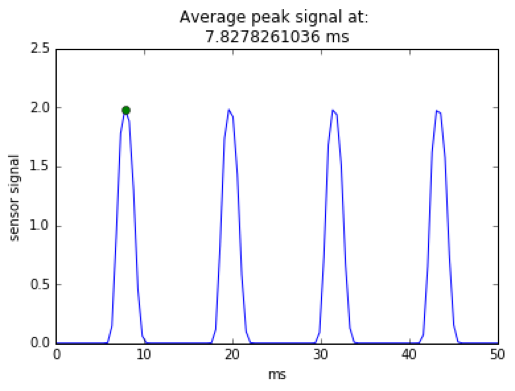
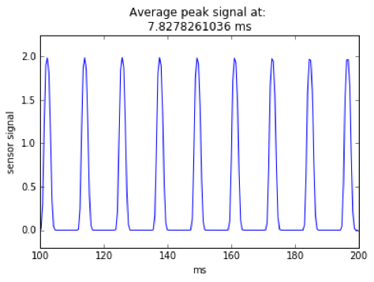

# EEGPhotosensor
A Python and Matlab library for measuring jitter between a visual stimuli on a monitor controlled by a stimulus computer &amp; markers / triggers received by EEG acquisition software

**Main functions are in Analysis/photosensor_analysis.py**

# Introduction
Timing is crucial in EEG experiments. We need to be certain that what the subjects sees, and when they see it, is exactly what we intended. For CRT monitors, this means that 1) stimulus presentations are synchronized to the vertical refresh rate of the monitor, 2) triggers indicating stimulus onsets are sent with accurate timing, 3) stimulus timing is accurate even for very short stimulus presentations. In order to test that these assumptions are met, we tested the timing accuracy of the new stimulus computer using Biosemi's optical sensor. The sensor is attached to the monitor to directly measure what gets presented, and, more importantly, when it gets presented. The basic idea is to present test stimuli on the CRT monitor, record the stimulus onsets directly with the optical sensor and simultaneously send notifications (e.g. markers, triggers, etc.) via parallel port to the EEG acquisition software via the EEG amplifier. We then compare the signal recorded by the sensor (read: what really happened on the screen) with what 1) Psychtoolbox and 2) the EEG triggers claim happened. In the present analysis, we look at what the EEG triggers claim about the onset of the visual stimuli. 

# Experimental Set-up


Figure 1. Photodiode placement on CRT monitor. A Biosemi optical sensor is attached to the top left corner of a Samsung SyncMaster 959NF-B CRT monitor. A white box is flashed on a black background for 1s, with 500ms pauses between flashes. The presentation stimuli sends a marker to the acquisition software indicating the onset of the white box. Simultaneously, the photosensor sends it analogue output to the acquisition software, which is recorded for later comparison.

```matlab
%....
% 
% see: https://groups.yahoo.com/neo/groups/psychtoolbox/conversations/topics/20169


% Open an on screen window
[window, windowRect] = Screen('OpenWindow', screenNumber, black);

% Measure the vertical refresh rate of the monitor
ifi = Screen('GetFlipInterval', window);

% Length of time and number of frames we will use for each drawing test
numSecs = 1;
numFrames = round(numSecs / ifi);

% numFrames = numFrames / 5
% Number of frames to wait when specifying good timing. Note: the use of
% wait frames is to show a generalizable coding. For example, by using
% waitframes = 2 one would flip on every other frame. See the PTB
% documentation for details. In what follows we flip every frame.
waitframes = 1 ;
 
% Get the size of the on screen window
[screenXpixels, screenYpixels] = Screen('WindowSize', window);

% Get the center coordinate of the window
[xCenter, yCenter] = RectCenter(windowRect);

% Make a base Rect of 200 by 200 pixels
baseRect = [0 0 200 200];

% Screen X positions of our three rectangles
squareXpos = [screenXpixels * 0.25 screenXpixels * 0.5 screenXpixels * 0.75];
numSqaures = length(squareXpos);
 
DoTriggers = 1
if DoTriggers; OpenTriggerPort; WaitSecs(0.5); StartSaveBDF;  WaitSecs(0.5); SendTrigger(0, 0.001); end

vbl = Screen('Flip', window);

for sweep = 1:200
    WaitSecs(0.50); 
    SendTrigger(10, 0.001);
    for frame = 1:numFrames 
        Screen('FillRect', window, [255 255 255], [0 0 200 200]);
        vbl = Screen('Flip', window, vbl + (waitframes - 0.5) * ifi);
    end 
    SendTrigger(0, 0.001);
    WaitSecs(0.50); 
    SendTrigger(20, 0.001);
    for frame = 1:numFrames
        Screen('FillRect', window, [0 0 0 ], [0 0 200 200]);
        vbl = Screen('Flip', window, vbl + (waitframes - 0.5) * ifi);
    end
    SendTrigger(0, 0.001);
end 

```

Box 1. A snippet of the Matlab script, which flashes the white box on the black background and sends triggers to Biosemi Actiview acquisition software.



Figure 2. All trials from the photosensor. 



Figure 3. Single trials from the photosensor. The green dot indicates the first highest peak in the sensor signal. Only the first 45ms of the signal was considered for the peak-detection algorithm.



Figure 4. Histogram of photosensor signal peak onsets (in ms) collected from Figure 3. Out of 200 trials, 166 peaks were detected at 7.89ms, 27 trials at 8.38ms, and 7 at 7.4ms. 



Figure 5. The average wave form for all photodiode trials (trials=200). No baseline correction was applied. 



Figure 6. First peak detected from the average waveform. Only the first 45ms of the signal was considered for the peak-detection algorithm. No baseline correction was applied. 



Figure 7. A slice of the average sensor signal from 100ms to 200ms. With a framerate of 85hz, we should see 8.5 frames every 100ms, which is almost what we see. This plot is encouraging. It's an independent check on the refresh rate. 
